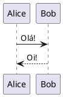

# 📌 Manual de Uso do Projeto SA_MS_02 - Docker

## 🔹 Como Rodar o Projeto

1. **Clone o repositório do GitHub**:
```sh
git clone https://github.com/seuusuario/sa-ms-02-docker.git
cd sa-ms-02-docker
```

2. **Construa a imagem Docker**:
```sh
docker build -t sa-ms-02 .
```

3. **Inicie os containers**:
```sh
docker-compose up -d
```

4. **Acesse os sistemas**:
   - **PlantUML**: `http://localhost:8080`
   - **GLPI (Chamados)**: `http://localhost`

## 🔹 Criando um Diagrama no PlantUML
1. Acesse `http://localhost:8080`
2. Digite o código abaixo e clique em renderizar:

3. Baixe ou copie o diagrama gerado.

## 🔹 Criando um Chamado no GLPI
1. Acesse `http://localhost`
2. Faça login com `glpi/glpi`
3. Vá em "Chamados" > "Criar Novo"
4. Preencha os campos e clique em "Salvar"

## 🚀 O projeto está pronto para uso!
